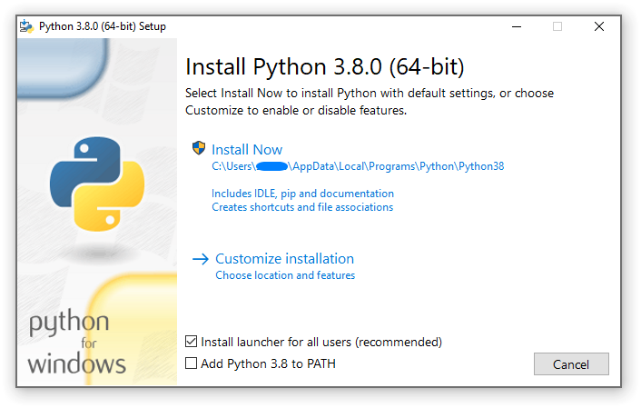

# install environment for OSM_GUI
you need:
* a python installation
* a virtual environment with all packages of [requirements](../requirements.txt) 

To get both, simply follow the next chapters.

## install python
If you do not have a python version now:
 * got to  [download python](https://www.python.org/downloads/windows/), and download `Windows x86-64 executable installer` or [directly download it](https://www.python.org/ftp/python/3.8.3/python-3.8.3-amd64.exe)
 * run the installer.exe as **Administrator**
 * toggle on ***Install launcher for all users*** and choose ***Install Now*** 
 * open cmd prompt or PowerShell and type py --> if no error occurs, python is installed correctly

 ## create virtual environment
 run setup.sh